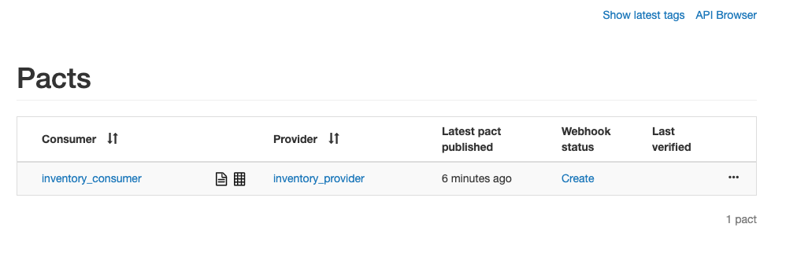
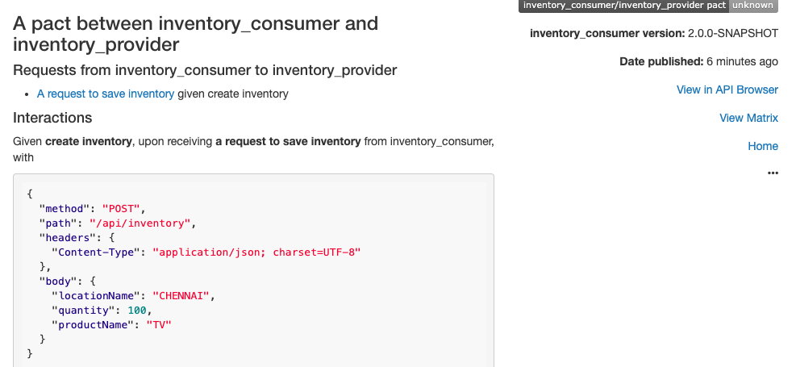
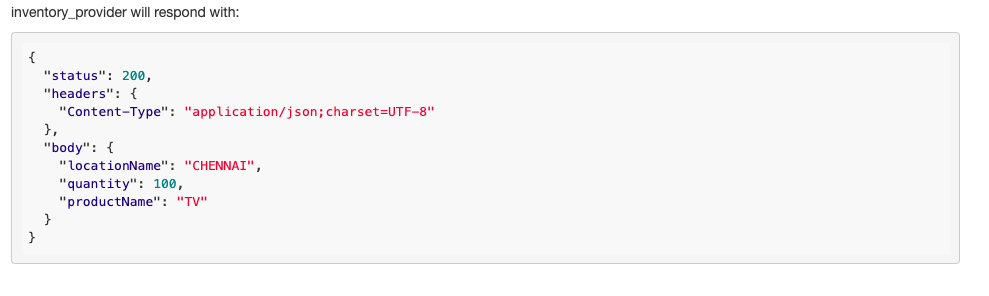

# Consumer Driven Contracts Using Pact Framework

#### Projects

<table>
 <tr>
 <th>Project</th><th> Description</th>
</tr>
<tr>
<td><b>pact-contract-provider</b></td>
<td>provider application</td>
</tr>
<tr>
<td><b>pact-contract-consumer</b></td>
<td>consumer application</td>
</tr>
	
</table>

#### Compatability Matrix

choose the branch based on below maintained versions.

<table>
 <tr>
    <th style="text-align:left">Branch/Version</th>
    <th style="text-align:left">Spring Boot</th>
    <th style="text-align:left">Pact Broker</th>
  </tr>
  <tr>
    <td>master</td>
    <td>2.1.5.RELEASE</td>
    <td>3.5.7</td>
  </tr>
  <tr>
    <td>v1.0</td>
    <td>1.5.7.RELEASE</td>
    <td>3.5.7</td>
  </tr>  
</table>

### Run Pact Broker 

- Start pact broker as docker containers

```
$ cd contract-pact-springboot
$ docker-compose up -d
```

- View Pact broker [url](http://localhost:8500)




### Guide for Pact Consumer

Start with consumer first, As it is consumer driven contract framework. 

- Add below dependencies in pom.xml

```xml
        	 <dependency>
		    <groupId>au.com.dius</groupId>
		    <artifactId>pact-jvm-consumer-junit_2.12</artifactId>
		    <version>3.6.7</version>
		    <scope>test</scope>
		</dependency>
```
- Add pact jvm provider maven plugin

```xml
	    <plugin>
                <groupId>au.com.dius</groupId>
                <artifactId>pact-jvm-provider-maven_2.12</artifactId>
                <version>3.6.7</version>
                <configuration>
                   <pactBrokerUrl>http://localhost:8500</pactBrokerUrl>
		   <pactDirectory>target/pacts</pactDirectory>               
                </configuration>
            </plugin>

```

- Write the consumer contract test 

```java
public class SaveInventoryConsumerTest{
    @Rule
    public PactProviderRuleMk2 mockProvider = new PactProviderRuleMk2("inventory_provider",PactSpecVersion.V3, this);
    private RestTemplate restTemplate=new RestTemplate();


    @Pact(provider = "inventory_provider", consumer = "inventory_consumer")
    public RequestResponsePact createPact(PactDslWithProvider builder) {
        Map<String, String> headers = new HashMap<>();
        headers.put("Content-Type", MediaType.APPLICATION_JSON_UTF8_VALUE);


        PactDslJsonBody bodyResponse = new PactDslJsonBody()
                .stringValue("productName", "TV")
                 .stringType("locationName", "CHENNAI")               
                .integerType("quantity", 100);

        return builder.given("create inventory").uponReceiving("a request to save inventory")
                .path("/api/inventory")
                .body(bodyResponse)
                .method(RequestMethod.POST.name())
                .willRespondWith()
                .headers(headers)
                .status(200).body(bodyResponse).toPact();
    }

	@Test
	@PactVerification
	public void testCreateInventoryConsumer() throws IOException {
		
		Inventory inventory=new Inventory("TV", "CHENNAI", 100);
    	HttpHeaders headers=new HttpHeaders();
    	headers.setContentType(MediaType.APPLICATION_JSON_UTF8);
    	HttpEntity<Object> request=new HttpEntity<Object>(inventory, headers);
    	ResponseEntity<String> responseEntity=restTemplate.postForEntity(mockProvider.getUrl()+"/api/inventory", request, String.class);
    	assertEquals("TV", JsonPath.read(responseEntity.getBody(),"$.productName"));
    	assertEquals("CHENNAI", JsonPath.read(responseEntity.getBody(),"$.locationName"));
    	assertEquals((Integer)100, (Integer)JsonPath.read(responseEntity.getBody(),"$.quantity"));
	}
```

- Run maven build to publish the pacts to the pact broker

```sh
mvn clean install pact:publish
```

- Verify the pact broker with the contracts






### Guide for Pact Provider 

Now move on to provider side

-  Add the below dependencies in pom.xml

```xml
     	<properties>		
		<pact.version>3.6.7</pact.version>
	</properties>
	<dependency>
	    <groupId>au.com.dius</groupId>
	    <artifactId>pact-jvm-provider-junit_2.12</artifactId>
	    <version>${pact.version}</version>
	    <scope>test</scope>
	</dependency>
	 <dependency>
	    <groupId>au.com.dius</groupId>
	    <artifactId>pact-jvm-provider-spring_2.12</artifactId>
	    <version>${pact.version}</version>
	    <scope>test</scope>
	</dependency>
```

- Add the pact provider test case

Test case to test against the pacts from the pact broker  to test against the pacts from the pact broker 

```java
@RunWith(SpringRestPactRunner.class)
@SpringBootTest(classes=PactContractProviderApplication.class,properties={"spring.profiles.active=test","spring.cloud.config.enabled=false"},webEnvironment = SpringBootTest.WebEnvironment.DEFINED_PORT)
@ActiveProfiles("test")
@PactBroker(host="localhost",port="8500")
@Provider("inventory_provider")
public class InventoryProviderTest {
	
	  @MockBean
	  private InventoryService inventoryService;

	  @TestTarget
	  public final Target target = new HttpTarget(9050);
  
	  @State(value="create inventory")
	  public void createInventoryState() throws Exception{

	      Inventory inventory=new Inventory("TV", "CHENNAI", 100);
	      when(inventoryService.saveInventory(any(Inventory.class))).thenReturn(inventory) ;
	  }
} 
```

- Run maven build at the provider side

```sh
mvn clean install 
(or)
mvn test
```


#### Notes: 

1. Using @PactBroker(host="localhost",port="8500") to define the pact broker host and port.
2. Using ```SpringRestPactRunner``` to load the spring container using @SpringBootTest
3. Starting the application server using the line ```new HttpTarget(9050)``` ensure that port matches with the one the application is started as it tests against the pacts downloaded from pact broker.
4. Mentioning Pact broker url and Pact directory is key to generate pacts at the consumer side.


